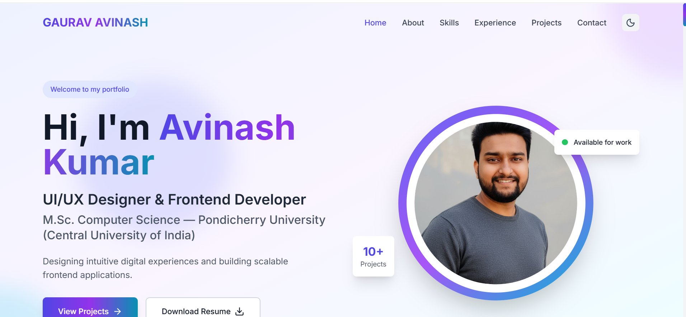
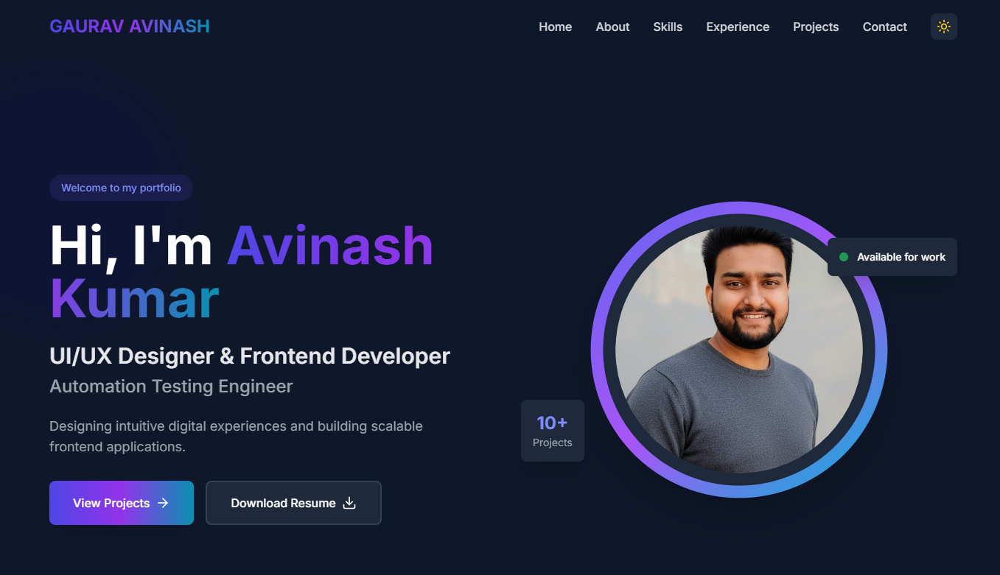

# React + Vite

This template provides a minimal setup to get React working in Vite with HMR and some ESLint rules.

Currently, two official plugins are available:

- [@vitejs/plugin-react](https://github.com/vitejs/vite-plugin-react/blob/main/packages/plugin-react) uses [Babel](https://babeljs.io/) (or [oxc](https://oxc.rs) when used in [rolldown-vite](https://vite.dev/guide/rolldown)) for Fast Refresh
- [@vitejs/plugin-react-swc](https://github.com/vitejs/vite-plugin-react/blob/main/packages/plugin-react-swc) uses [SWC](https://swc.rs/) for Fast Refresh

## React Compiler

The React Compiler is not enabled on this template because of its impact on dev & build performances. To add it, see [this documentation](https://react.dev/learn/react-compiler/installation).

## Expanding the ESLint configuration

If you are developing a production application, we recommend using TypeScript with type-aware lint rules enabled. Check out the [TS template](https://github.com/vitejs/vite/tree/main/packages/create-vite/template-react-ts) for information on how to integrate TypeScript and [`typescript-eslint`](https://typescript-eslint.io) in your project.

🌐 Personal Portfolio Website

A modern and responsive Personal Portfolio Website built using React to showcase my skills, projects, and professional journey in UI/UX Design, Frontend Development, Mobile App Development, and Automation Testing.

This portfolio serves as a digital identity and professional showcase, highlighting my work, technical expertise, and passion for building intuitive digital experiences.

The website is designed with a minimal, modern interface and includes smooth animations, responsive layouts, and an organized project showcase to provide visitors with an engaging user experience.

📖 About the Project

This project was created to demonstrate my ability to design and develop modern web interfaces and scalable frontend applications. It reflects my expertise in:

Designing intuitive user interfaces

Developing responsive frontend applications

Implementing modern UI animations

Structuring maintainable and scalable codebases

The portfolio highlights my academic background as an M.Sc. Computer Science graduate from Pondicherry Central University, along with my professional interests in software development and UI/UX design.

✨ Features

The portfolio includes several features designed to provide a modern and engaging experience.

🎨 Modern UI Design

A clean and minimal interface with carefully structured layouts and typography to enhance readability and user experience.

🌙 Dark & Light Mode

Users can toggle between dark and light themes for a comfortable viewing experience.

📱 Fully Responsive

Optimized for all screen sizes including:

Desktop

Tablets

Mobile devices

⚡ Smooth Animations

Interactive animations powered by motion libraries to improve engagement and visual appeal.

📂 Project Showcase

A dedicated section displaying projects with descriptions, technologies used, and repository links.

📬 Contact Section

Visitors can easily connect through social platforms or contact forms.

🖼️ Screenshots

🏠 Hero Section

The hero section introduces the developer with a professional summary and navigation to other sections.

📂 Projects Section

Displays key projects with technology stacks and repository links.

📞 Contact Section

Allows visitors to reach out through social links or email.

🛠️ Tech Stack

This project was developed using modern frontend technologies and tools.

Frontend

⚛️ React

🎨 CSS / TailwindCSS

🎬 Framer Motion

🧠 JavaScript (ES6+)

Development Tools

📦 Node.js

🧰 npm

🖥️ Visual Studio Code

Version Control

🔧 Git

🐙 GitHub